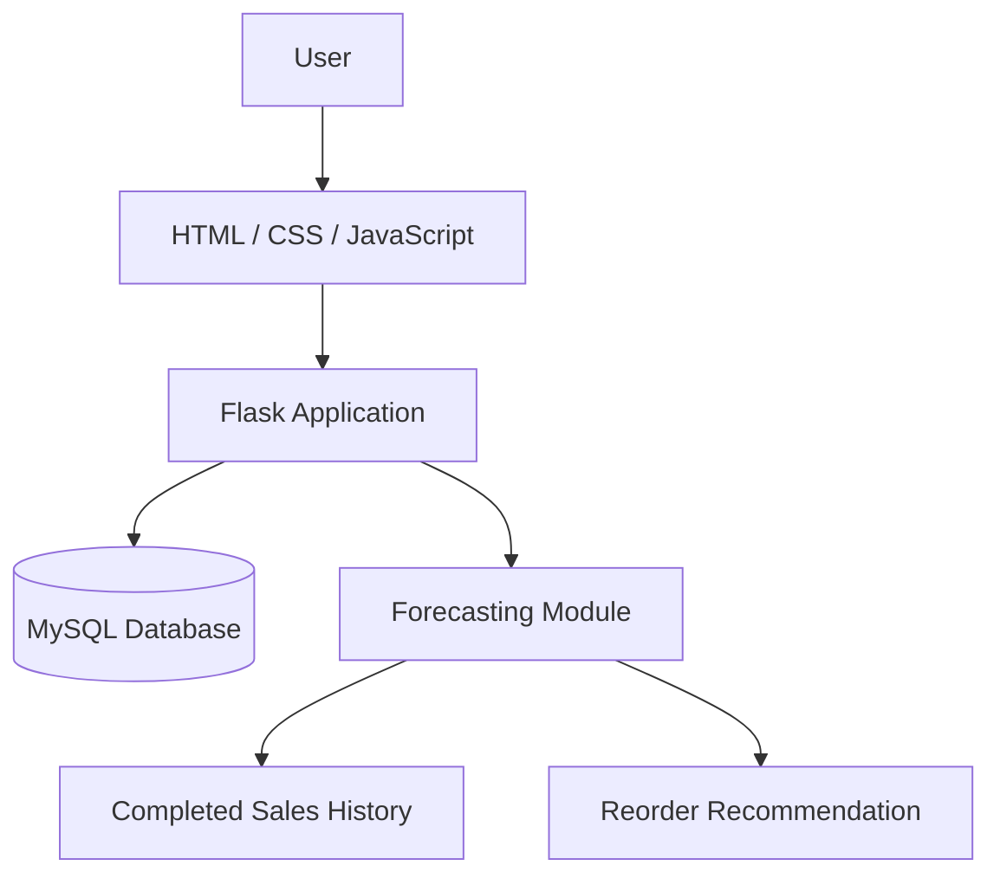
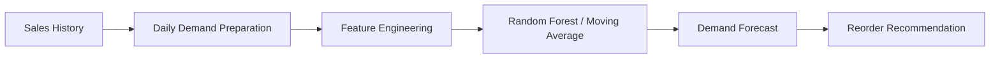
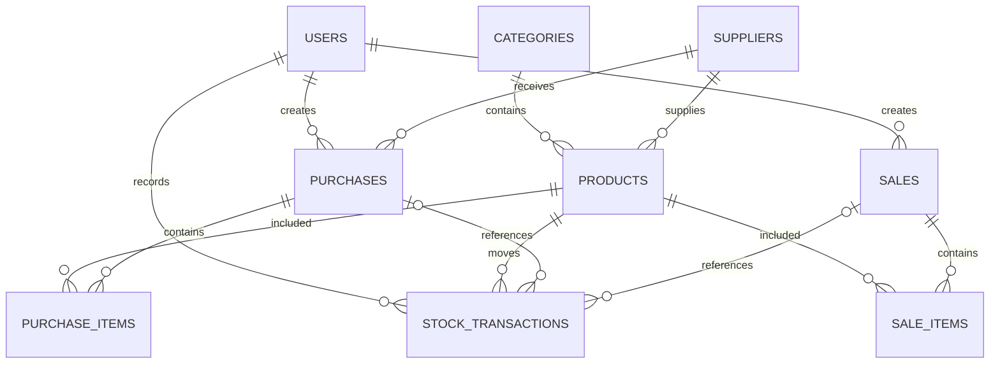

# Inventory-AI

Inventory-AI is a beginner-friendly inventory management system for a
B.Tech final-year project. It provides MySQL-backed authentication, product
and supplier management, purchase and sales workflows, stock history,
dashboard analytics, and explainable demand forecasting.

## Features

- User authentication with hashed passwords and Flask sessions
- Product management
- Category management
- Supplier management
- Purchase management with atomic stock receiving
- Sales management with stock validation and cancellation
- Inventory tracking and controlled stock adjustments
- Stock transaction history
- Dashboard analytics
- Demand forecasting with a moving-average baseline
- Random Forest ML demand prediction
- Explainable reorder recommendations

## Technology stack

- Frontend: HTML, CSS, vanilla JavaScript, Jinja2
- Backend: Python 3.10, Flask
- Database: MySQL 8.0+
- ML: scikit-learn Random Forest Regression and joblib model persistence

## System architecture



The forecasting flow is:



## Database

The schema is defined in `database/inventory.sql` and contains:

- `users`
- `categories`
- `suppliers`
- `products`
- `purchases`
- `purchase_items`
- `sales`
- `sale_items`
- `stock_transactions`

## Entity relationship diagram

This diagram reflects the relationships in the current schema.



## AI/ML approach

The forecasting page uses completed sales only. Daily quantities are
aggregated from `sales` and `sale_items`, and days without sales are retained
as zero-demand observations.

The Random Forest model uses:

- Day of week
- Day of month
- Month
- Day of year
- Previous-day demand lags (`lag_1`, `lag_2`, `lag_3`, `lag_7`)
- Previous-seven-day rolling mean

Features never include the current target quantity. Historical data is split
chronologically: earlier observations train the model and later observations
form the test set. The model is evaluated with MAE and RMSE and compared with
the existing seven-day moving-average baseline. The lower held-out MAE wins;
ties keep the moving-average baseline.

Models are cached per product under `models/*.joblib`. These generated files
are ignored by Git. The recommendation uses forecasted demand and the
existing reorder level, but does not yet model lead time, safety stock,
seasonality, promotions, or sudden demand changes.

## Installation

1. Clone the repository:

   ```powershell
   git clone <repository-url>
   cd Inventory-AI
   ```

2. Create and activate a Python 3.10 virtual environment:

   ```powershell
   python -m venv inventory_env
   .\inventory_env\Scripts\Activate.ps1
   ```

3. Install dependencies:

   ```powershell
   python -m pip install -r requirements.txt
   ```

4. Copy `.env.example` to `.env` and set local values.
5. Create the MySQL database and tables:

   ```text
   mysql -u root -p < database/inventory.sql
   ```

6. Create a local administrator:

   ```powershell
   flask --app app create-admin
   ```

7. Start locally:

   ```powershell
   python app.py
   ```

8. Open <http://127.0.0.1:5000/>.

For deployment, the included `Procfile` runs:

```text
web: gunicorn app:app
```

## Environment variables

Use placeholders from `.env.example`; never commit real credentials.

```text
MYSQL_HOST=localhost
MYSQL_USER=root
MYSQL_PASSWORD=your_mysql_password
MYSQL_DATABASE=inventory_db
SECRET_KEY=replace_with_a_long_random_secret_key
FLASK_DEBUG=false
```

`FLASK_DEBUG=true` is intended only for local troubleshooting. The
application defaults to debug mode off.

## Usage

1. Sign in with an administrator created by `flask create-admin`.
2. Manage categories, suppliers, and products.
3. Create purchases and receive incoming stock.
4. Record sales; completed sales reduce stock atomically.
5. Review inventory, adjust stock with a required reason, and inspect history.
6. Use the dashboard for summaries and recent activity.
7. Open Demand Forecast, select an active product, and review the baseline or
   evaluated Random Forest forecast.

## Project structure

```text
Inventory-AI/
├── app.py
├── config.py
├── requirements.txt
├── Procfile
├── .env.example
├── database/
│   └── inventory.sql
├── scripts/
│   └── train_demand_model.py
├── templates/
│   ├── base.html
│   ├── 404.html
│   ├── 500.html
│   └── ...feature templates
├── static/
│   ├── css/style.css
│   └── js/script.js
├── utils/
│   ├── forecasting.py
│   └── helpers.py
└── models/
    └── generated *.joblib files (ignored)
```

## Future enhancements

- Supplier lead-time-aware reorder planning
- Seasonal forecasting
- Safety stock optimization
- Expanded role-based permissions
- Cloud deployment configuration
- Email and notification alerts
- Scheduled model retraining
